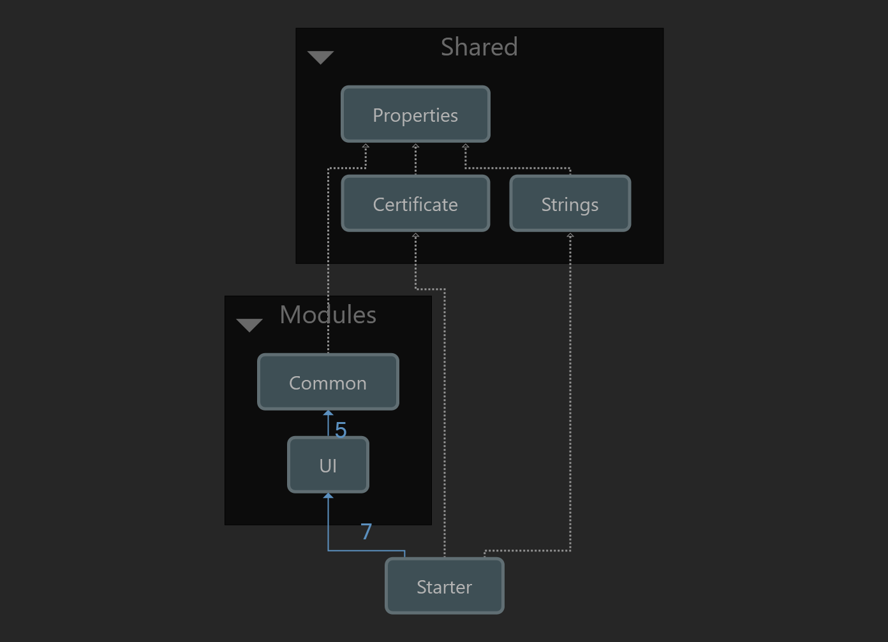
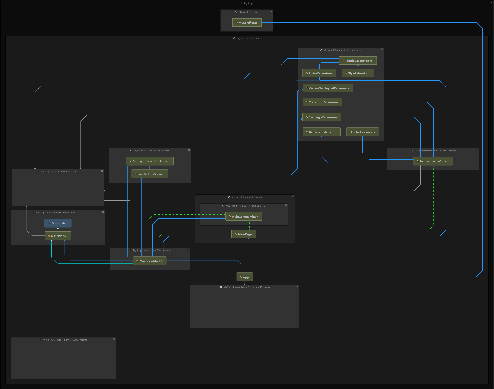

MyScript Interactive Ink SDK | Starter | UWP
============================================

This project demonstrates a simple way to integrate [MyScript Interactive Ink SDK](https://developer.myscript.com/docs/interactive-ink/1.3/overview/about/) into your UWP app.

1. [Project Structure](#project-structure)
2. [Class/Type Structure](#classtype-structure)
3. [Several You-Must-Knows](#several-you-must-knows)
4. [Disclaimer](#disclaimer)

Project Structure
-----------------



This project consists of 3 groups:

- The application project [`Starter`](src/Starter/README.md);
- The shared libraries `Modules`, including:
  - Library `Common`;
  - Library [`UI`](src/UI/README.md);
- The shared sources, including:
  - The shared assembly info `Properties`;
  - The shared localization `Strings`;
  - The shared `Certificate` from [MyScript Developer](https://developer.myscript.com), which is required to integrate Interactive Ink SDK.

> To obtain your own developer certificate, please follow the official [instructions](https://developer.myscript.com/getting-started/windows).

Class/Type Structure
--------------------



Corresponding to the project structure, classes/types are grouped into the following namespaces:

- `Starter` -> `MyScript.InteractiveInk.*`;
- `Common` -> `MyScript.InteractiveInk.Common.*`;
- `UI` -> `MyScript.InteractiveInk.UI.*`

The entry point is [`App`](src/Starter/App.xaml.cs), which creates and holds a [`Engine`](src/Starter/App.xaml.cs#L22) instance with `MyCertificate`.
Then the `App` launches [`MainPage`](src/starter/Views/MainPage.xaml), which creates and holds a corresponding [`MainViewModel`](src/Starter/ViewModels/MainViewModel.cs) to hold an [`Editor`](src/Starter/ViewModels/MainViewModel.cs#L34) instance.
The `Editor` is supposed to be attached to the UI control [`InteractiveInkCanvas`](src/UI/Xaml/Controls/InteractiveInkCanvas.xaml), which handles the most of rendering commands and exposes interactivity from Interactive Ink SDK to the application layer.

The main implementation lies in [`InteractiveInkCanvas`](src/UI/Xaml/Controls/InteractiveInkCanvas.xaml.cs), to apply this controls in application, you have to:

First, create an `Editor` (see [`MainViewModel`](src/Starter/ViewModels/MainViewModel.cs#L54)):

```csharp
// Code behind.
public Editor Editor { get; set; }
// Assumes that the DPI is the default value 96.
var dpi = 96;
var renderer = engine.CreateRenderer(dpi, dpi, RenderTarget);
Editor = engine.CreateEditor(renderer);
```

Then attach the `Editor` to `InteractiveInkCanvas` (see [`MainPage`](src/Starter/Views/MainPage.xaml#L33)):

```xml
<!-- Xaml -->
<Page xmlns:iink="using:MyScript.InteractiveInk.UI.Xaml.Controls">
    <iink:InteractiveInkCanvas
        x:Name="RenderTarget"
        Editor="{x:Bind Editor, Mode=OneWay}" />
</Page>
```

Several You-Must-Knows
----------------------

Basically, Interactive Ink SDK follows the most common inking mechanism: input the user pointer events into the `Editor`, then the `Editor` outputs the rendering commands, which are supposed to be implemented by developers on their platforms.
Therefore, the following are the points that you have to implement to integrate Interactive Ink SDK into your app:

- Input pointer events
  - [`PointerPressed`](src/UI/Xaml/Controls/InteractiveInkCanvas.xaml.cs#L388) => [`Editor.PointerDown`](src/UI/Extensions/EditorExtensions.cs#L45);
  - [`PointerMoved`](src/UI/Xaml/Controls/InteractiveInkCanvas.xaml.cs#L377) => [`Editor.PointerMove`](src/UI/Extensions/EditorExtensions.cs#L56);
  - [`PointerReleased`](src/UI/Xaml/Controls/InteractiveInkCanvas.xaml.cs#L399) => [`Editor.PointerUp`](src/UI/Extensions/EditorExtensions.cs#L72);
  - [`PointerCanceled`](src/UI/Xaml/Controls/InteractiveInkCanvas.xaml.cs#L366) => [`Editor.PointerCancel`](src/UI/Extensions/EditorExtensions.cs#L36);
- Output rendering commands
  - Implement `IRenderTarget`;
  - Implement shape drawing commands `ICanvas` & `IPath`;

> See [more information](https://developer.myscript.com/docs/interactive-ink/1.3/windows/fundamentals/) about MyScript Interactive Ink SDK.

Disclaimer
----------

> This project is only a representative of personal views, instead of any official positions!
